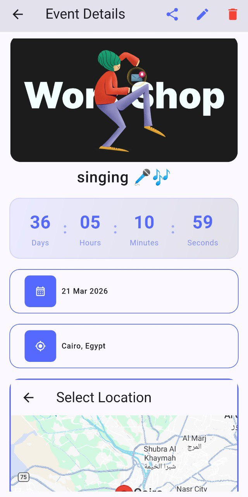
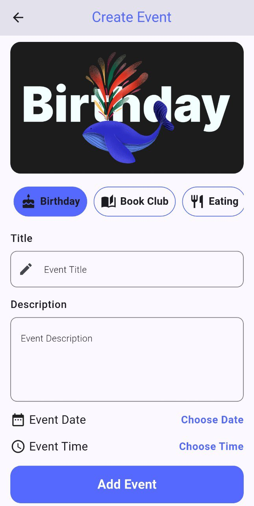
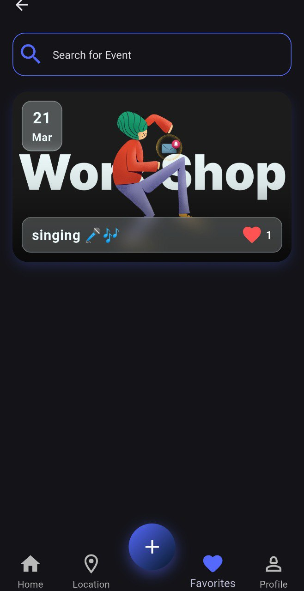
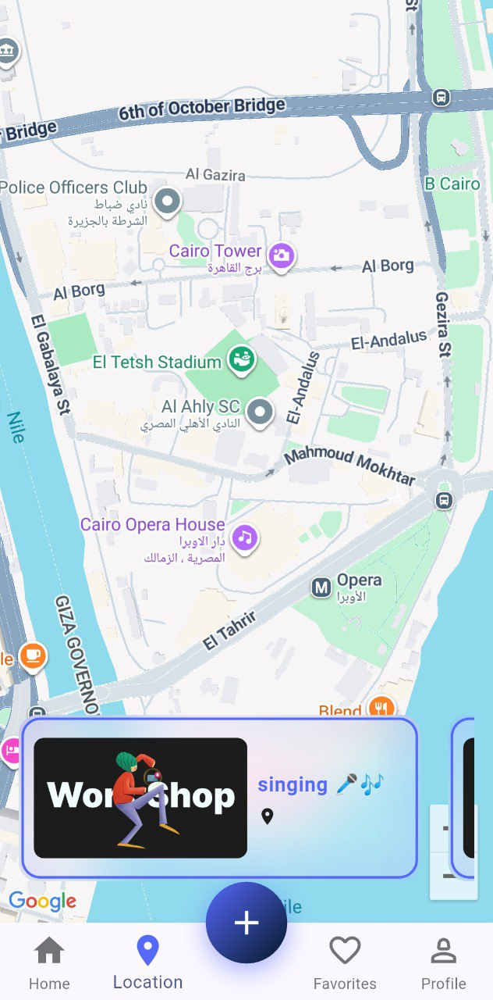
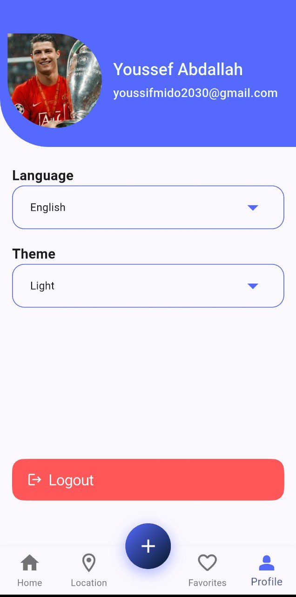

# 🌟 Evently - Event Management App


Evently is a modern, feature-rich **Flutter** application designed to help users organize, discover, and manage events effortlessly. Built with clean architecture and powered by **Firebase**, it offers a seamless experience with real-time updates and interactive features.

[](https://flutter.dev)
[](https://dart.dev)
[](https://firebase.google.com)
[](https://developers.google.com/maps)

---

## ✨ Key Features 

### 🚀 Core Functionality

- **🔐 Secure Authentication**: Login & Sign Up with Firebase Auth (Email/Password & Google).
- **📅 Event Management**: Create, Edit, and Delete events with ease.
- **📍 Interactive Maps**: Pick event locations directly on Google Maps.
- **❤️ Favorites System**: Save events to your favorites list with **Swipe-to-Remove** support.
- **🔍 Smart Search**: Filter events by category (Sport, Birthday, Meeting, etc.) or name.

### 🎨 User Experience (UI/UX)

- **🌙 Dark & Light Mode**: Full theme support for comfortable viewing.
- **🌍 Localization**: Complete support for **English** and **Arabic** (RTL).
- **⏳ Live Countdown**: Real-time countdown timer for upcoming events.
- **📤 Easy Sharing**: Share event details with a clickable **Google Maps link**.
- **✨ Animations**: Smooth transitions (Hero, FadeInUp) and glassmorphism UI elements.

---

## 📸 Screenshots 

|                  Home Screen                  |                 Event Details                 |                   Add Event                   |
| :--------------------------------------------: | :--------------------------------------------: | :--------------------------------------------: |
|  |  |  |

|                Favorites (Dark)                |                    Map View                    |                    Profile                    |
| :--------------------------------------------: | :--------------------------------------------: | :--------------------------------------------: |
|  |  |  |

---

## 🛠️ Tech Stack & Architecture

- **State Management**: BLoC / Cubit Pattern.
- **Architecture**: MVVM / Clean Architecture principles.
- **Backend**: Firebase Firestore & Authentication.
- **Location**: Google Maps Flutter & Geolocation.
- **Storage**: Shared Preferences for local settings (Theme/Language).

---

## 🚀 Getting Started

1. **Clone the repository:**
   ```bash
   git clone https://github.com/yourusername/evently.git
   ```
2. **Install dependencies:**
   ```bash
   flutter pub get
   ```
3. **Setup Firebase:**
   - Add `google-services.json` (Android) and `GoogleService-Info.plist` (iOS).
4. **Run the app:**
   ```bash
   flutter run
   ```

---

## 📬 Contact

Created by ***Youssef Abdallah*** - LinkedIn Profile (www.linkedin.com/in/youssef-abdallah-)

If you like this project, give it a star! ⭐
